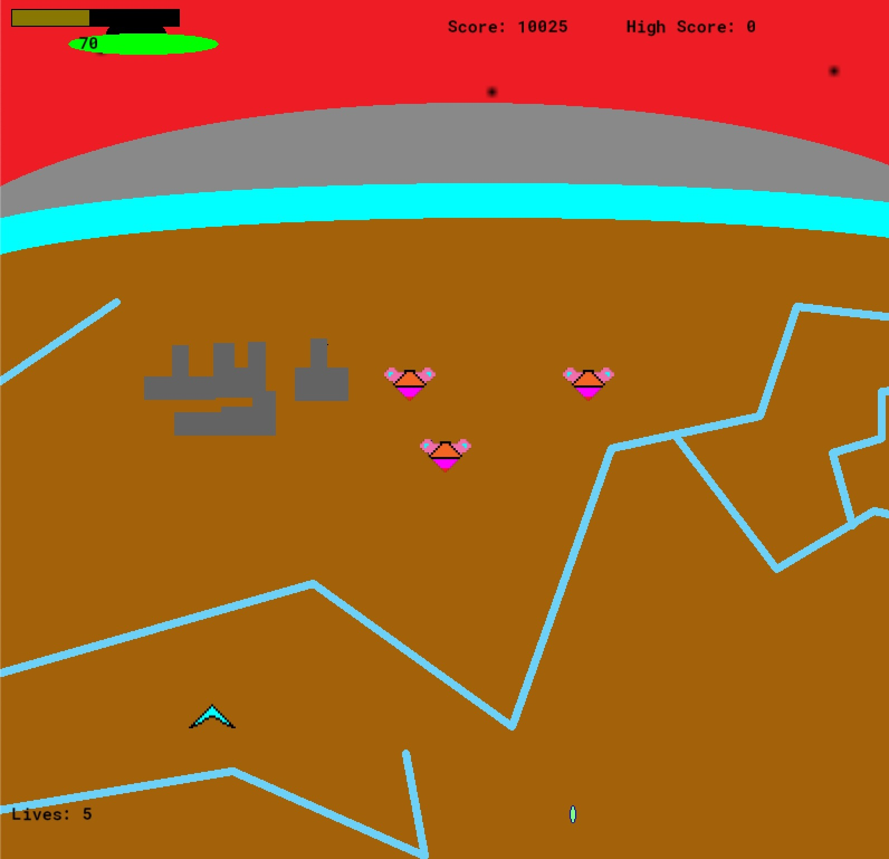
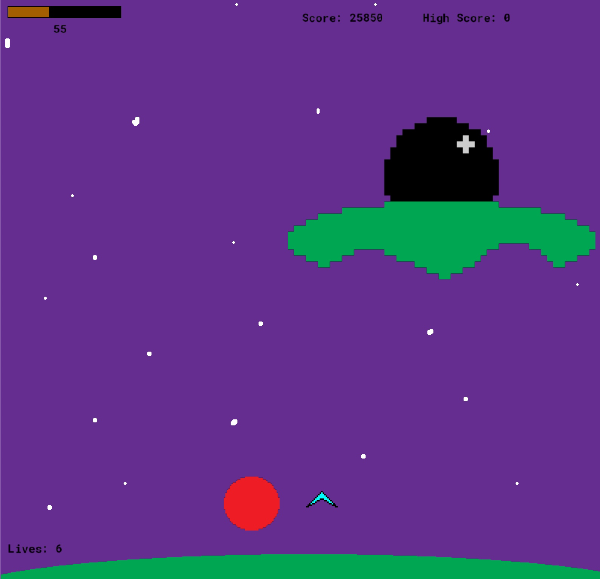
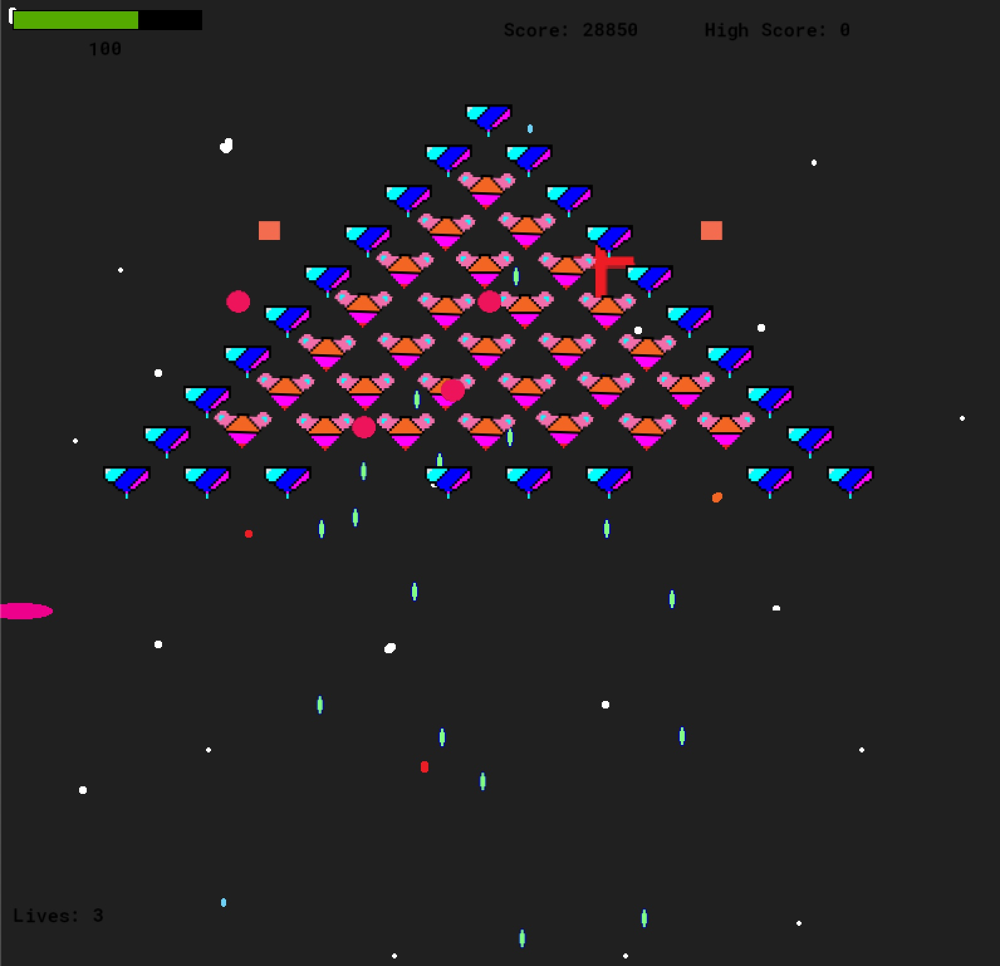

<h1>  Alien Shooter </h1>

Sick of playing AAA games with $100+ million budgets and photorealistic visuals?
Well my friend, look no further as our game was made on a shoe string budget.
In a time when quarantine was required, one man, with to much time decided to go on an quest.
A quest to create the best alien killing space shooter ever made!

<h2> Lore </h2>

Meet space commander Lee Harvey Oswald.  
He will be your key to the stars!   
When his mother and father were shot in Hell's kitchen.. 
a man told him to become a dark guardian and defend their honor.  
However, Oswald didn't like his parents, so he told the man no thanks. 
The man was sad, so he waddled away, waddle...waddle.  
Instead, he decided to join the galactic border patrol and stop illegal aliens 
from entering our airspace. Mostly because it paid really well.  
Things took a turn when he won the yearly shoots and ladders tournament. 
His superior officer was the reining champion and couldn't stand the loss. 
So, as punishment, he sent Commander Lee to try and stop the 5 alien families.  
Little did they know, this mission would be the very mission a game would be made about. 
That's the game you are looking at the ReadMe file about.
   

Do you dare travel with him  into the unknown?!

<h2> Behold! </h2>

  - 25 unique levels (sort of)
  - Upgrades that almost matter
  - 5 bosses from 'out of this world'
  

<h3> State of the art visuals <h3>

  <h2> Download and Play Today! </h2>
  https://newnez.itch.io/alien-shooter 

  
<h2 align="center"> Contributions </h2>
I wouldnt' try and change perfection; however if you wish to try...it might not hurt if we had a bit more testing done.
Feedback on level difficulty for example won't be completely ignored..
Also, this was made with GameMaker 2.0 which is free of this writing to download and use.
Simply open the project after downloading from GitHub in GM 2.0 and play it after making your 'improvements'.
  
<h2 align="center">License</h3>
I'm a generous man. I know what I have, and after some serious thought, I realized this cannot be witheld from the nations.
Share and share bountifully. No license will stand in your way.

<h2 align="center">Credits</h3>
I'd like to thank George Washington for finding America so that I could be free to make this game.
